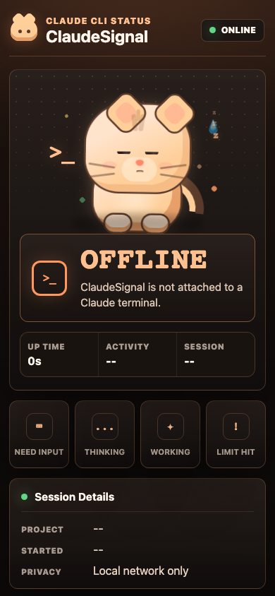
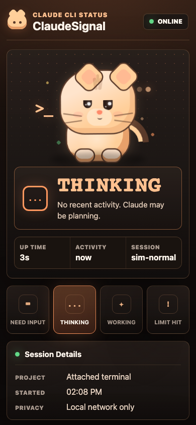
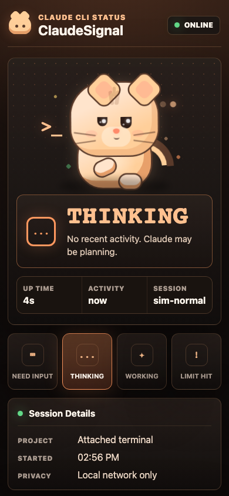
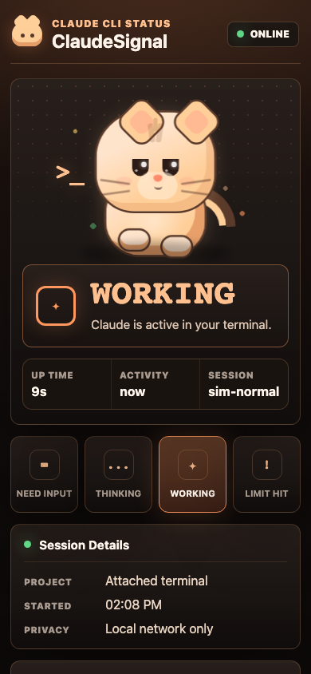
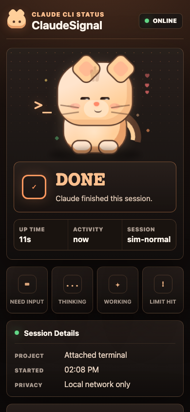
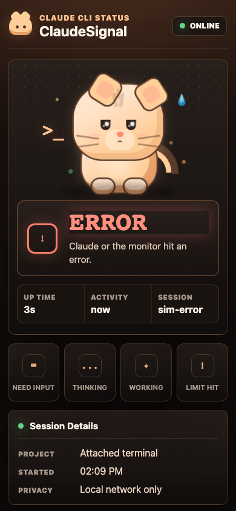
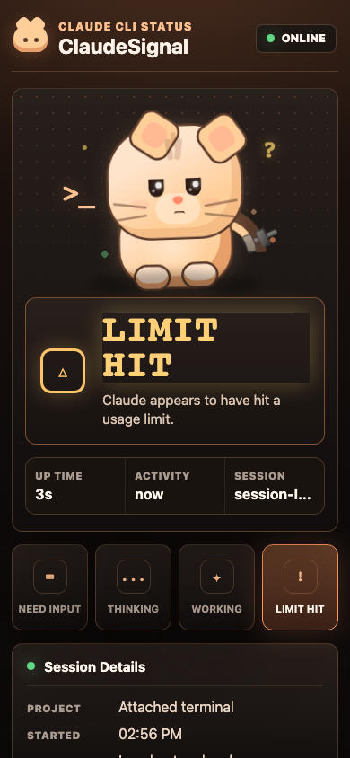
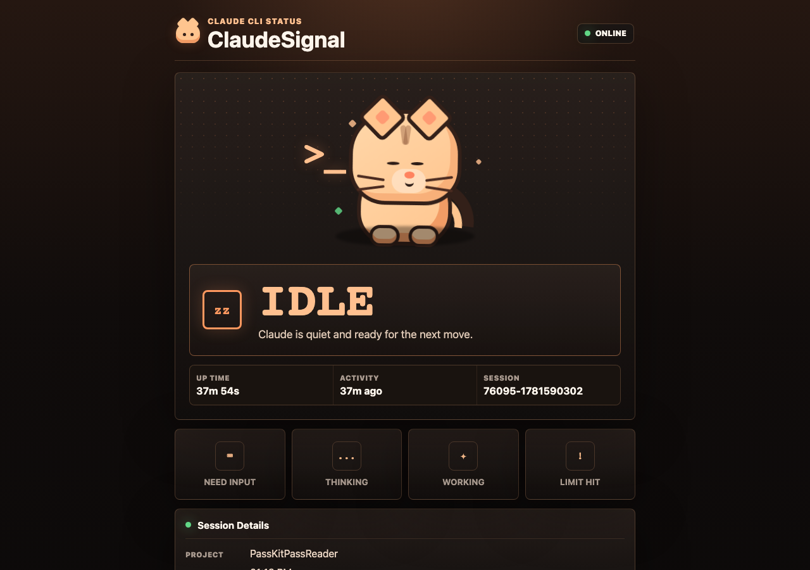

# ClaudeSignal

ClaudeSignal is a local-first live status monitor for Claude CLI. It runs on your Mac, starts a lightweight Axum web server, and shows Claude session status in a mobile-friendly dashboard you can open from another device on the same Wi-Fi.

No cloud services, external APIs, telemetry, uploads, databases, or permanent log files are used in the MVP. Recent output is kept in memory only.

## Dashboard

| Idle | Working | Thinking |
|------|---------|----------|
|  |  |  |

| Waiting Input | Completed | Error |
|---------------|-----------|-------|
|  |  |  |

| Session Limit | Desktop |
|---------------|---------|
|  |  |

The cat mascot changes expression and animation based on Claude's status — sleeping when idle, focused typing when working, chin-scratch thinking pose, expectant when waiting for input, happy hearts when completed, worried sweat when errored, dumbbell workout when hitting limits. It reacts to hover/touch with ear wiggles, purring, blush marks, and cursor-tracking eyes.

## Why It Exists

ClaudeSignal lets you see whether Claude CLI is working, thinking, waiting for input, completed, errored, or hit a session limit without sitting in front of the terminal.

## Tech Stack

- Rust
- Tokio
- Axum
- Axum WebSocket
- Static HTML, CSS, and JavaScript
- In-memory status store
- In-memory ring buffer for logs
- `clap` CLI

## Install Rust

Install Rust from <https://rustup.rs/> if you do not already have it:

```bash
curl --proto '=https' --tlsv1.2 -sSf https://sh.rustup.rs | sh
```

Then verify:

```bash
rustc --version
cargo --version
```

## Run Dashboard Only

```bash
cargo run -- serve
```

Open:

```text
http://localhost:3000
```

## Run Simulator

Normal flow:

```bash
cargo run -- simulate
```

Session-limit flow:

```bash
cargo run -- simulate --scenario session-limit
```

Error flow:

```bash
cargo run -- simulate --scenario error
```

## Run Claude Through ClaudeSignal

```bash
cargo run -- run -- claude
```

Or pass a prompt:

```bash
cargo run -- run -- claude "review this repository"
```

The MVP captures stdout and stderr and inherits stdin. Full interactive TTY behavior can vary by CLI behavior and terminal environment.

## Quick Start

```bash
cd /Volumes/Nyi-Nyi-Sandisk/Claude/ClaudeSignal && ./scripts/install-claude-wrapper.sh
```

Then open a **new terminal** and run:

```bash
claude "summarize this repo"
```

Inside Claude, type `/ClaudeSignal` to see the dashboard URL. Open it on your phone to see the cat monitor live.

## Open From Phone

1. Connect your Mac and phone to the same Wi-Fi.
2. Start ClaudeSignal.
3. Copy the Network URL printed in the terminal.
4. Open that URL in your phone browser.

Example:

```text
http://192.168.1.45:3000
```

## HTTP Routes

- `GET /`
- `GET /styles.css`
- `GET /app.js`
- `GET /api/health`
- `GET /api/status`
- `GET /api/logs`
- `GET /ws`

## Troubleshooting

Dashboard shows IDLE when Claude is working:

- The wrapper must route through `claude-signal run` to capture output. Reinstall the wrapper: `./scripts/install-claude-wrapper.sh`
- Make sure `~/.local/bin` is before the real `claude` in your PATH
- Test by running `which claude` — it should point to `~/.local/bin/claude`

Phone cannot open dashboard:

- Make sure both devices are on the same Wi-Fi.
- Make sure the server is running.
- Check the Mac firewall.
- Use the Network URL, not `localhost`.
- Try opening from another computer on the same network.
- Make sure port `3000` is not blocked.

Port already in use:

```bash
cargo run -- --port 3001 simulate
```

## Privacy And Security

ClaudeSignal exposes recent Claude output to devices on the same local network. Use it only on trusted Wi-Fi. Do not port-forward it to the internet.

The MVP intentionally avoids auth to keep local setup simple. A password or pairing code is a good next step.

## Known Limitations

- Claude CLI may not expose exact internal state.
- Thinking, waiting-input, and session-limit detection use simple heuristics.
- Interactive TTY support may be limited in the MVP.
- Logs are memory-only and reset when the app restarts.
- The dashboard is intended for trusted local networks only.

## Next Steps

- Add optional dashboard password or pairing code.
- Add a localhost-only mode.
- Improve Claude CLI TTY handling.
- Add configurable thinking timeout and log buffer size.
- Package as a single native binary.
