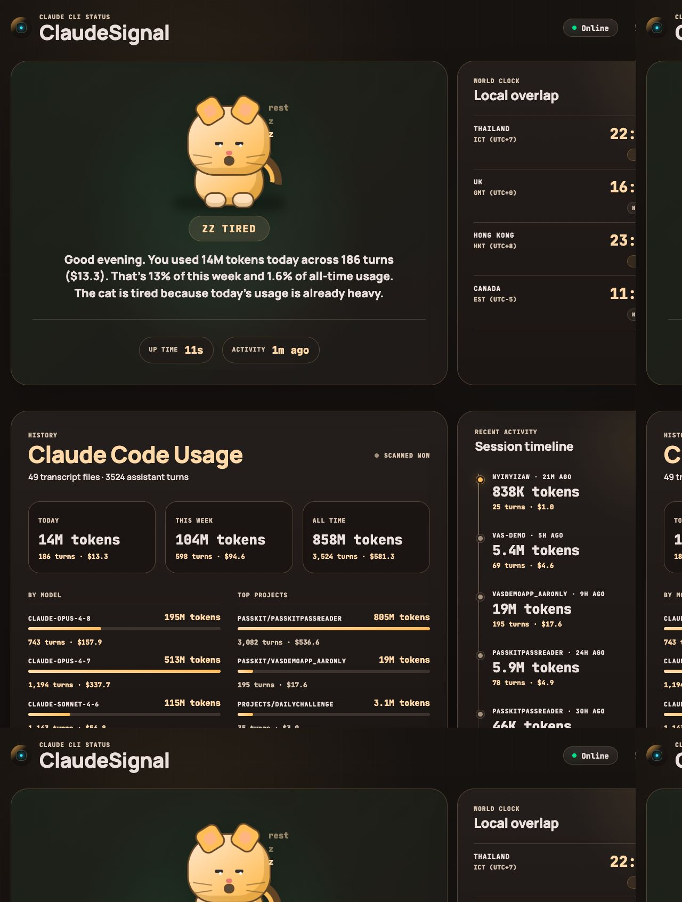
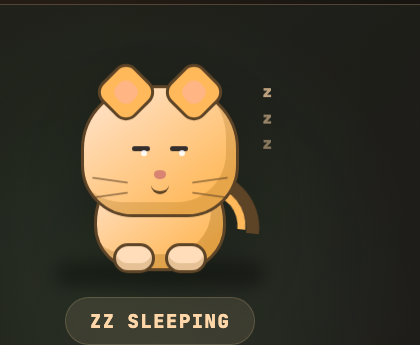
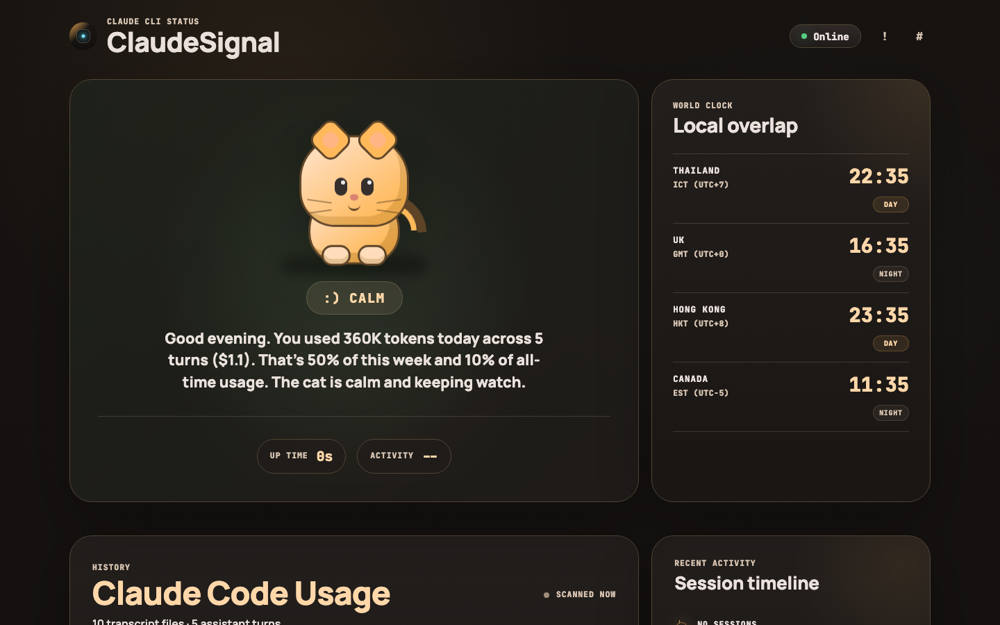
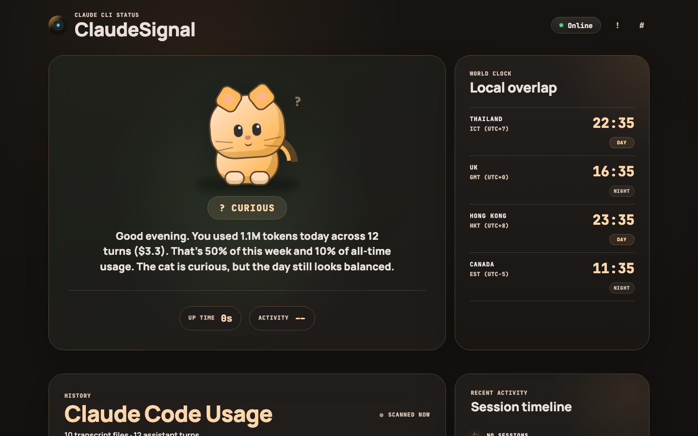
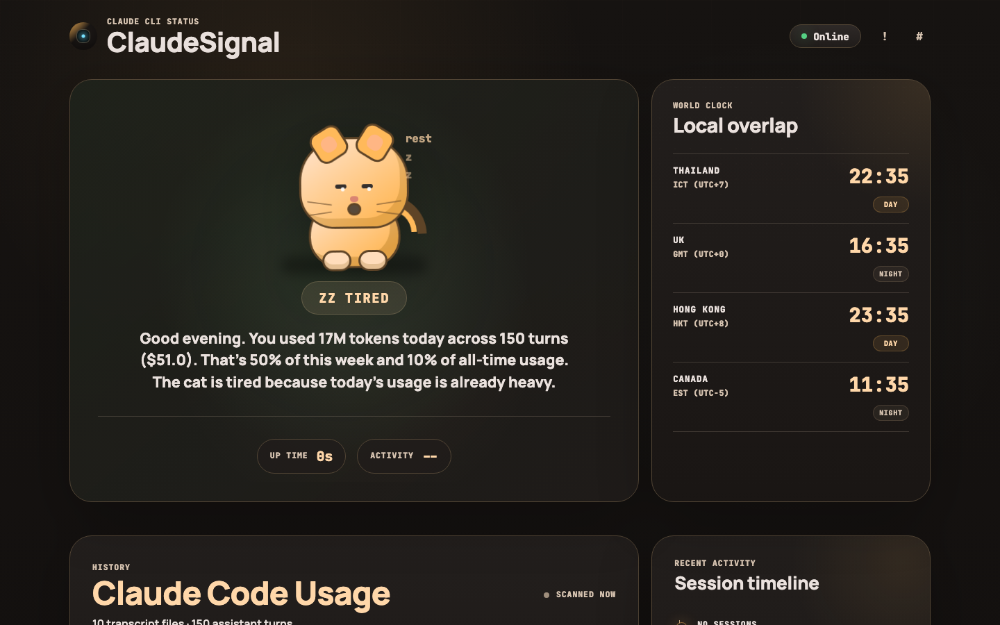

# ClaudeSignal

ClaudeSignal is a local-first Claude Code usage dashboard for macOS. It runs as a single Rust binary, serves a web UI on your local network, and turns local Claude transcript history into a focused dashboard with usage totals, project/model breakdowns, recent sessions, a 7-day activity chart, themes, and an animated cat that reacts to your daily token usage.

No hosted service, telemetry, uploads, or database. Usage data stays on your machine.

## Current Dashboard



ClaudeSignal currently focuses on **Claude Code usage history**, not a hosted account API. It reads local JSONL transcripts from Claude Code and computes:

- Today, this week, and all-time token totals
- Estimated cost from known model pricing
- Assistant turn counts
- Model breakdowns
- Top projects
- Recent sessions
- 7-day activity for tokens and requests

The dashboard also includes:

- Animated cat companion whose mood reacts to today's usage
- World clock for Thailand, UK, Hong Kong, and Canada
- Theme selector in the header
- Settings panel with theme cards
- Local network URL for opening the dashboard from another browser/device

## How Usage Data Works

ClaudeSignal uses two local data sources:

1. **Local transcript scanner**
   - Implemented in `src/usage_history.rs`
   - Scans:
     - `~/.claude/projects`
     - `~/Library/Developer/Xcode/CodingAssistant/ClaudeAgentConfig/projects`
   - Powers the main usage dashboard, cat mood, recent sessions, and 7-day activity chart.

2. **Claude Code status-line bridge**
   - Implemented in `src/status_line.rs` and `src/usage.rs`
   - Receives Claude Code status-line JSON when configured.
   - Powers live context/session usage when Claude exposes it locally.

`tools/claude-usage` may exist locally as a reference clone of `phuryn/claude-usage`, but ClaudeSignal does **not** run it as a service or depend on it at runtime.

## Cat Mood

The top card features an animated cat whose mood changes based on today's transcript-derived token usage:

| Mood | Trigger | Cat behavior |
|------|---------|--------------|
| **Sleeping** | No usage history or 0 tokens today | Eyes closed, slow tail swish |
| **Calm** | < 1M tokens today | Relaxed breathing, gentle tail |
| **Curious** | 1M+ tokens today | Head tilt, perked ears |
| **Focus** | 6M+ tokens today | Narrowed eyes, tapping paw |
| **Busy** | 15M+ tokens today | Alert ears, active paw, brighter glow |
| **Tired** | 25M+ tokens today | Droopy eyes, yawning mouth |
| **Overload** | 45M+ tokens today | Wide eyes, jitter animation |

Example briefing:

```text
Good evening. You used 14M tokens today across 186 turns ($13.3).
That's 13% of this week and 1.6% of all-time usage.
The cat is focused; usage is picking up.
```

The cat also responds to interaction: mouse movement makes its eyes follow your cursor, and clicking triggers a playful pounce animation.

## Cat Mood Gallery

| Sleeping | Calm | Curious |
|:--------:|:----:|:-------:|
|  |  |  |

| Focus | Tired | Overload |
|:-----:|:-----:|:--------:|
|  |  |  |

## Quick Start

### 1. Build

```bash
cargo build
```

### 2. Start the dashboard

```bash
cargo run -- --port 3004 simulate
```

Or run the normal server:

```bash
cargo run -- --port 3004 serve
```

Open:

```text
http://localhost:3004
```

The terminal also prints a network URL, for example:

```text
http://192.168.1.111:3004
```

Use that network URL from another browser or device on the same trusted Wi-Fi.

### 3. Optional: install Claude Code status-line integration

```bash
./scripts/install-claude-wrapper.sh
```

The installer:

- Creates a Claude status-line bridge at `~/.claude/claude-signal-statusline.sh`
- Configures `~/.claude/settings.json` with a `statusLine` command when Node.js is available
- Installs a conservative `claude` wrapper at `~/.local/bin/claude`

The dashboard should still be started separately with `claude-signal serve` or `cargo run -- serve`.

## Run Commands

```bash
# Dashboard on default port 3000
cargo run -- serve

# Dashboard on a custom port
cargo run -- --port 3004 serve

# Simulator with seeded status behavior
cargo run -- --port 3004 simulate
cargo run -- simulate --scenario session-limit
cargo run -- simulate --scenario error

# Run a command through the monitor
cargo run -- run -- claude "review this repository"

# Emit one Claude Code status-line update
cargo run -- status-line
```

## Dashboard Sections

### Cat Status Panel

Shows:

- Mood-driven cat animation
- Daily usage briefing
- Uptime
- Last activity timestamp

The cat mood is based only on local Claude Code usage history.

### World Clock

Shows current time in:

- Thailand (ICT, UTC+7)
- UK
- Hong Kong (HKT, UTC+8)
- Canada / Toronto

### System Activity

Shows a 7-day chart above the main usage card:

- **Tokens**: total input, output, cache read, and cache creation tokens per day
- **Requests**: assistant turns per day

### Claude Code Usage

Shows:

- Today / this week / all-time totals
- Assistant turns
- Estimated cost
- By-model usage
- Top projects

### Recent Sessions

Shows the latest local Claude Code sessions with:

- Project name
- Last activity
- Token total
- Turn count
- Estimated cost

## Themes and Settings

ClaudeSignal includes a header theme selector and a settings panel. Available themes:

- Cozy Warm
- Matcha Calm
- Graphite Focus
- Ember Night

Theme selection is stored in browser `localStorage`.

## Architecture

```text
                         ┌─────────────────────────────┐
                         │ Claude Code status-line JSON │
                         └──────────────┬──────────────┘
                                        │ POST /api/usage
                                        ▼
┌──────────────┐ stdout/stderr ┌────────────────┐   broadcast   ┌──────────────┐
│ Claude / CLI │──────────────►│ StatusStore    │──────────────►│ WebSocket /ws│
│ child PTY    │               │ UsageStore     │               └──────┬───────┘
└──────────────┘               └───────┬────────┘                      │
                                       │                               │
                                       ▼                               ▼
                              ┌────────────────┐              ┌────────────────┐
                              │ HTTP API        │─────────────►│ Web dashboard  │
                              │ Axum routes     │              │ cat + usage UI │
                              └───────┬────────┘              └────────────────┘
                                      │
                                      ▼
                         ┌─────────────────────────────┐
                         │ Local Claude JSONL scanner  │
                         │ ~/.claude/projects, Xcode   │
                         └─────────────────────────────┘
```

See [ARCHITECTURE.md](ARCHITECTURE.md) for module-level details.

## HTTP Routes

| Route | Method | Description |
|-------|--------|-------------|
| `/` | GET | Dashboard HTML |
| `/styles.css` | GET | Dashboard stylesheet |
| `/app.js` | GET | Dashboard JavaScript |
| `/api/health` | GET | Health check |
| `/api/status` | GET | Current session status |
| `/api/logs` | GET | Recent log entries |
| `/api/usage` | GET | Live status-line usage snapshot |
| `/api/usage` | POST | Post Claude Code status-line JSON |
| `/api/usage/history` | GET | Aggregated local transcript usage history |
| `/ws` | GET | WebSocket updates |

See [API.md](API.md) for request and response schemas.

## Tech Stack

- **Rust**: single binary
- **Axum**: HTTP server and WebSocket routing
- **Tokio**: async runtime
- **portable-pty**: optional command monitoring
- **Static HTML/CSS/JS**: no frontend build step
- **Local JSONL scanning**: reads Claude Code transcripts directly

## Privacy and Security

ClaudeSignal is local-first:

- No hosted backend
- No telemetry
- No uploads
- No external API calls for usage data
- Transcript-derived data is read locally
- Runtime state is kept in memory

The server binds to `0.0.0.0` so other devices on your local network can open the dashboard.

Use only on trusted private networks. Do not port-forward it to the internet.

See [SECURITY.md](SECURITY.md) for the threat model and mitigations.

## Troubleshooting

**Dashboard does not update**

- Restart the dashboard process
- Make sure you are opening the correct port
- Re-run `./scripts/install-claude-wrapper.sh` if status-line data is missing
- Open a new terminal after installing the wrapper

**Another browser or phone cannot open the dashboard**

- Use the network URL, not `localhost`
- Make sure both devices are on the same Wi-Fi
- Check macOS firewall settings
- Try another port: `--port 3004`

**Usage history is empty**

- Run Claude Code at least once so JSONL transcripts exist
- Check whether `~/.claude/projects` exists
- Xcode Claude integration transcripts are scanned separately if present

**Plan limits do not match Claude's official modal**

- ClaudeSignal does not call a private Claude account limits API
- Weekly/session limit data is shown only when Claude exposes it through local status-line JSON
- The main dashboard usage totals are transcript-based and local

## Known Limitations

- No authentication yet
- Cost is estimated from local token counts and known pricing
- Plan-limit percentages are only available when Claude exposes them locally
- Transcript formats may change over time
- Usage history depends on files present on this Mac

## Contributing

See [CONTRIBUTING.md](CONTRIBUTING.md) for build, test, and development instructions.
